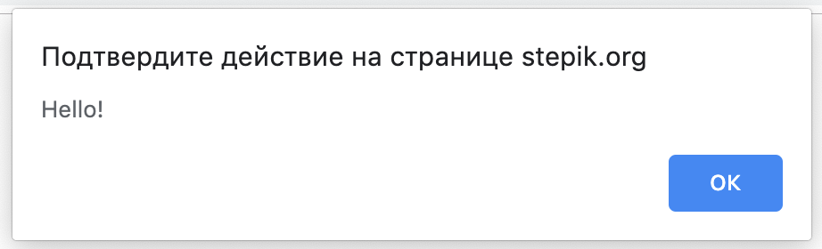
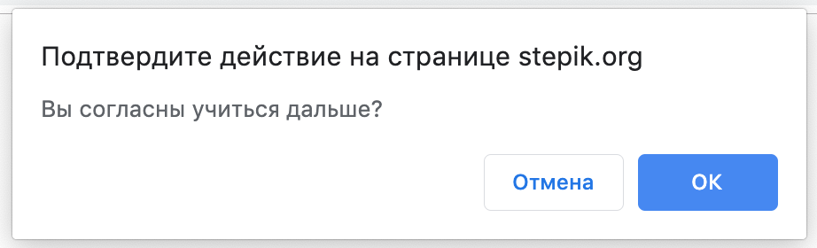
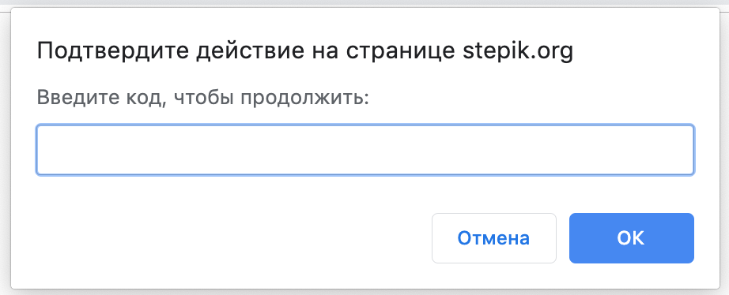

# Поиск элементов с помощью XPath
В работе с веб-страницами не всегда получается найти селектор, однозначно описывающий путь к нужному элементу. В такой ситуации для тестировщика лучшим решением проблемы будет пойти к фронтенд-разработчику проекта и договориться о специальном атрибуте, который будет использоваться в автотестах. Таким образом можно повысить тестируемость приложения. Увы, проекты бывают разные, и не всегда это возможно. И когда другого выхода больше нет, а автоматизировать как-то надо, можно обратиться к помощи языка запросов XPath.

На тему XPath мнения расходятся, но, как бы то ни было, это мощный и гибкий инструмент, который позволяет писать сложные запросы для поиска элементов.

Прежде всего, XPath (*XML Path Language*) это язык запросов, который использует древовидную структуру документа. Проверять XPath-запросы можно точно так же как и CSS-селекторы — в консоли разработчика. Откройте консоль [на странице с котиками](http://suninjuly.github.io/cats.html) , и давайте на её примере разберемся в основах синтаксиса. Попробуйте вбить каждый из запросов-примеров в строку поиска, чтобы увидеть, что именно находит поисковый запрос.

## 1. Начало запроса
XPath запрос всегда начинается с символа `/` или `//`.
Символ `/` аналогичен символу `>` в CSS-селекторе, а символ `//` — пробелу. Их смысл:

`el1/el2` — выбирает элементы `el2`, являющиеся **прямыми потомками** `el1`;  
`el1//el2` — выбирает элементы `el2`, являющиеся **потомками** `el1` **любой степени вложенности**.
Разница состоит в том, что в XPath, когда мы начинаем запрос с символа `/`,  мы должны указать элемент, являющийся корнем нашего документа. Корнем всегда будет элемент с тегом `<html>`. Пример: `/html/body/header`

Мы можем начинать запрос и с символа `//`. Это будет означать, что мы хотим найти всех потомков корневого элемента без указания корневого элемента. В этом случае, для поиска того же хедера, мы можем выполнить запрос `//header`, так как других заголовков у нас нет.

###### **Важно!** Такой поиск может быть неоднозначным. Например, запрос `//div` вернет вам все элементы с тегом `<div>`. Избегайте неоднозначных ситуаций, они плохо влияют на здоровье ваших автотестов.

## 2. Фильтрация
Символ `[ ]` — это команда фильтрации
Если по запросу найдено несколько элементов, то будет произведена фильтрация по правилу, указанному в скобках.

**Правил фильтрации очень много:**

+ по любому атрибуту, будь то `id`, `class`, `title` (или любой другой). Например, мы хотим найти картинку с летящим котом, для этого можно выполнить запрос `//img[@id='bullet']`
+ по порядковому номеру. Допустим, мы хотим выбрать вторую по порядку карточку с котом. Для этого найдем элемент с классом `row` и возьмем его второго потомка: `//div[@class="row"]/div[2]`
+ по полному совпадению текста. Да, XPath — это единственный способ найти элемент по внутреннему тексту. Если мы хотим найти блок текста с котом-Лениным, можно воспользоваться XPath селектором `//p[text()="Lenin cat"]`. Такой селектор вернет элемент, только если текст полностью совпадет. Здесь важно сказать, что не всегда поиск по тексту — это хорошая практика, особенно в случае мультиязычных сайтов.
+ по частичному совпадению текста или атрибута. Для этого нужна функция `contains`. Запрос `//p[contains(text(), "cat")]` вернет нам все абзацы текста, которые содержат слово `cat`. Точно так же можно искать по частичному совпадению других атрибутов, это удобно, если у элемента несколько классов. Посмотрите на код навбара сайта с котами. Его можно найти селектором `//div[contains(@class, "navbar")]`
+ в фильтрации еще можно использовать булевы операции (`and`, `or`, `not`) и некоторые простые арифметические выражения (но вообще не стоит, наверное). Допустим, мы хотим найти картинку обязательно с data-type "animal" и именем "bullet-cat", для этого подойдет запрос: //img[@name='bullet-cat' and @data-type='animal']
## 3. Символ * 
Символ * — команда выбора всех элементов
Например, можем найти текст в заголовке запросом `//div/*[@class="jumbotron-heading"]`. Это может быть удобно, когда мы не знаем точно тег элемента, который ищем.
## 4. Регистрозависимость 
Поиск по классу в XPath регистрозависим.
Также как и в случае поиска по CSS-селектором будьте внимательными к регистру при поиске по классам: 

`//div/*[@class="Jumbotron-heading"]` не найдет элемент на нашей странице.

 

**Что важно знать про XPath, чтобы пользоваться им безболезненно:**

+ Не используйте селекторы вида `//div[1]/div[2]/div[3]` без крайней нужды: по такому селектору невозможно с первого раза понять, что за элемент вы ищете. А когда структура страницы хоть немного изменится, то ваш селектор с большой вероятностью перестанет работать;
+ Если есть возможность использовать CSS-селекторы: `сlass`, `id` или `name` — лучше использовать их вместо поиска по XPath;
+ Можно искать по полному или частичному совпадению текста или любого атрибута;
+ Можно использовать булевы операции и простую арифметику;
+ Можно удобно перемещаться по структуре документа (переходить к потомкам и к родителям);
+ Подойдет, когда у сайта всё плохо с атрибутами и нет возможности достучаться до разработчиков;
+ Есть мнение, что поиск по XPath в среднем медленнее, чем по css. Но достоверно это неизвестно;
+ Не стоит использовать разные расширения для браузеров по поиску XPath: они подбирают нечитабельные и переусложненные селекторы. Лучше потратить немного времени и разобраться в синтаксисе самостоятельно, тем более, что он не очень сложный.

В курсе мы не будем работать с XPath-селекторами, и в основном будем использовать CSS. В случае необходимости можно познакомиться с XPath подробнее по следующим ссылкам:

https://www.w3schools.com/xml/xpath_syntax.asp  
https://msdn.microsoft.com/ru-ru/library/ms256086(v=vs.120).aspx  
https://msiter.ru/tutorials/xpath/syntax  
https://habr.com/post/114772/  
https://testerslittlehelper.wordpress.com/2016/07/10/real-xpath/

# Поиск элементов с помощью Selenium
Для поиска элементов на странице в Selenium WebDriver используются несколько стратегий, позволяющих искать по атрибутам элементов, текстам в ссылках, CSS-селекторам и XPath-селекторам. Для поиска Selenium предоставляет метод `find_element`, который принимает два аргумента - тип локатора и значение локатора. Существуют следующие методы поиска элементов:

+ `find_element(By.ID, value)` — поиск по уникальному атрибуту id элемента. Если ваши разработчики проставляют всем элементам в приложении уникальный id, то вам повезло, и вы чаще всего будет использовать этот метод, так как он наиболее стабильный;
+ `find_element(By.CSS_SELECTOR, value)` — поиск элемента с помощью правил на основе CSS. Это универсальный метод поиска, так как большинство веб-приложений использует CSS для вёрстки и задания оформления страницам. Если find_element_by_id вам не подходит из-за отсутствия id у элементов, то скорее всего вы будете использовать именно этот метод в ваших тестах;
+ `find_element(By.XPATH, value)` — поиск с помощью языка запросов XPath, позволяет выполнять очень гибкий поиск элементов;
+ `find_element(By.NAME, value)` — поиск по атрибуту name элемента;
+ `find_element(By.TAG_NAME, value)` — поиск элемента по названию тега элемента;
+ `find_element(By.CLASS_NAME, value)` — поиск по значению атрибута class;
+ `find_element(By.LINK_TEXT, value)` — поиск ссылки на странице по полному совпадению;
+ `find_element(By.PARTIAL_LINK_TEXT, value)` — поиск ссылки на странице, если текст селектора совпадает с любой частью текста ссылки.  

Например, мы хотим найти кнопку со значением `id="submit_button"`:
```
from selenium import webdriver
from selenium.webdriver.common.by import By

browser = webdriver.Chrome()
browser.get("http://suninjuly.github.io/simple_form_find_task.html")
button = browser.find_element(By.ID, "submit")
```
Обратите внимание, что мы импортировали класс `By`, который содержит все возможные локаторы.  
Если страница у вас загрузилась, но дальше ничего не происходит, вернитесь обратно в консоль, в которой вы запускали ваш скрипт. Скорее всего, вы увидите там ошибку `NoSuchElementException`. Она будет выглядеть следующим образом:
```
selenium.common.exceptions.NoSuchElementException: Message: no such element: Unable to locate element: {"method":"id","selector":"submit"}
```
Ошибка очевидна: мы неправильно указали локатор — значит, кнопки с таким `id` на странице нет.

Исправим локатор, чтобы наш код проходил без ошибок:
```
from selenium import webdriver
from selenium.webdriver.common.by import By

browser = webdriver.Chrome()
browser.get("http://suninjuly.github.io/simple_form_find_task.html")
button = browser.find_element(By.ID, "submit_button")
```

**Поиск нескольких элементов**  
Вы можете столкнуться с ситуацией, когда на странице будет несколько элементов, подходящих под заданные вами параметры поиска. В этом случае WebDriver вернет вам _только первый элемент, который встретит во время поиска по HTML. Если вам нужен не первый, а второй или следующие элементы, вам нужно либо задать более точный селектор для поиска, либо использовать методы `find_elements`, которые мы рассмотрим чуть позже.  
Иногда в статьях про Selenium WebDriver вы также будете встречать термин "локаторы", под которым подразумеваются стратегии поиска и значения, по которым должен выполняться поиск. Например, можно искать по локатору `By.ID` со значением "send_button".

# Работа с браузером в Selenium
Если вы уже пробовали запускать примеры скриптов, то могли заметить, что браузер не всегда закрывается после выполнения кода. Поэтому обратите внимание на то, что необходимо явно закрывать окно браузера в нашем коде при помощи команды `browser.quit()`. Каждый раз при открытии браузера `browser = webdriver.Chrome()` в системе создается процесс, который останется висеть, если вы вручную закроете окно браузера. Чтобы не остаться без оперативной памяти после запуска нескольких скриптов, всегда добавляйте к своим скриптам команду закрытия:
```
from selenium import webdriver
from selenium.webdriver.common.by import By

link = "http://suninjuly.github.io/simple_form_find_task.html"
browser = webdriver.Chrome()
browser.get(link)
button = browser.find_element(By.ID, "submit_button")
button.click()

# закрываем браузер после всех манипуляций
browser.quit()
```
Важно еще пояснить разницу между двумя командами: `browser.close()` и `browser.quit()`. Какая между ними разница, ведь на первый взгляд обе они осуществляют одно и то же?  
На самом деле, `browser.close()` закрывает текущее окно браузера. Это значит, что если ваш скрипт вызвал всплывающее окно, или открыл что-то в новом окне или вкладке браузера, то закроется только текущее окно, а все остальные останутся висеть. В свою очередь `browser.quit()` закрывает все окна, вкладки, и процессы вебдрайвера, запущенные во время тестовой сессии. Подробнее можно посмотреть здесь: [Difference between webdriver.Dispose(), .Close() and .Quit()](https://stackoverflow.com/questions/15067107/difference-between-webdriver-dispose-close-and-quit). Будьте внимательны с этими методами и, в общем случае, всегда используйте `browser.quit()`. 

Но что будет, если скрипт не дойдет до выполнения этого финального шага, а упадет с ошибкой где-то раньше? 

Для того чтобы гарантировать закрытие, даже если произошла ошибка в предыдущих строках, проще всего использовать конструкцию `try / finally`: 
```
from selenium import webdriver
from selenium.webdriver.common.by import By

link = "http://suninjuly.github.io/simple_form_find_task.html"

try:
    browser = webdriver.Chrome()
    browser.get(link)
    button = browser.find_element(By.ID, "submit_button")
    button.click()

finally:
    # закрываем браузер после всех манипуляций
    browser.quit()
```
Можете попробовать запустить оба примера и обратить внимание на разницу.  
Подробно говорить об обработке исключений мы сейчас не будем, здесь важно понимать только то, что даже если в коде внутри блока `try` произойдет какая-то ошибка, то код внутри блока `finally` выполнится в любом случае. Советуем добавлять такую обработку ко всем своим скриптам при выполнении задач этого и следующего модулей, а в третьем модуле мы обсудим более лаконичные конструкции.  
Если хотите узнать больше про исключения, как их кидать, ловить и как с ними жить, то советуем к прохождению вот этот урок:  [Ошибки и исключения](https://stepik.org/lesson/24463/step/1?unit=6771).  
# Поиск всех необходимых элементов с помощью find_elements
Мы уже упоминали, что метод `find_element` возвращает только первый из всех элементов, которые подходят под условия поиска. Иногда возникает ситуация, когда у нас есть несколько одинаковых по сути объектов на странице, например, иконки товаров в корзине интернет-магазина. В тесте нам нужно проверить, что отображаются все выбранные для покупки товары. Для этого существует метод `find_elements`, которые в отличие от `find_element` вернёт список всех найденных элементов по заданному условию. Проверив длину списка, мы можем удостовериться, что в корзине отобразилось правильное количество товаров. Пример кода (код приведен только для примера, сайта [fake-shop.com](fake-shop.com) скорее всего не существует):
```
# подготовка для теста
# открываем страницу первого товара
# данный сайт не существует, этот код приведен только для примера
browser.get("https://fake-shop.com/book1.html")

# добавляем товар в корзину
add_button = browser.find_element(By.CSS_SELECTOR, ".add")
add_button.click()

# открываем страницу второго товара
browser.get("https://fake-shop.com/book2.html")

# добавляем товар в корзину
add_button = browser.find_element(By.CSS_SELECTOR, ".add")
add_button.click()

# тестовый сценарий
# открываем корзину
browser.get("https://fake-shop.com/basket.html")

# ищем все добавленные товары
goods = browser.find_elements(By.CSS_SELECTOR, ".good")

# проверяем, что количество товаров равно 2
assert len(goods) == 2
```
**!Важно.**  
Обратите внимание на важную разницу в результатах, которые возвращают методы `find_element` и `find_elements`. Если первый метод не смог найти элемент на странице, то он вызовет ошибку `NoSuchElementException`, которая прервёт выполнение вашего кода. Второй же метод всегда возвращает валидный результат: если ничего не было найдено, то он вернёт пустой список и ваша программа перейдет к выполнению следующего шага в коде.
# Уникальность селекторов: часть 1
Мы уже упоминали, что идеальный селектор — это такой селектор, который позволяет найти только один искомый элемент на странице. Благодаря уникальным селекторам наши тесты становятся стабильнее и меньше зависят от изменений в вёрстке страницы. Небольшие изменения разработчики делают достаточно часто, а мы бы не хотели постоянно исправлять наши тесты.  
Другое важное замечание: хороший тест проверяет только маленькую, атомарную часть функциональности. Простые тесты, которые проверяют небольшой сценарий, лучше, чем один большой тест, проверяющий сразу много сценариев. Благодаря простым тестам мы быстрее локализуем место в продукте, где появился баг, а также можем найти одновременно несколько новых багов. Упавший большой автотест укажет только на первую встреченную проблему, так как он заканчивает работу при первой же найденной ошибке. В этом их отличие от ручных тестов, в которых мы, проверяя функциональность продукта по тест-кейсу, можем гибко обойти встречающиеся проблемы и пройти тест-кейс до конца, найдя все баги.  
Рассмотрим следующий пример: у нас есть форма регистрации, в которой есть обязательные и необязательные поля для заполнения. Нужно проверить, что можно успешно зарегистрироваться на сайте.  
Сценарий плохого автотеста:
+ 1 
  + Открыть страницу с формой
  + Заполнить все поля
  + Нажать кнопку "Регистрация"
  + Проверить, что есть сообщение об успешной регистрации  

Лучше разбить предыдущий тест на набор более простых автотестов:
+ 1
    + Открыть страницу с формой
    + Заполнить только обязательные поля
    + Нажать кнопку "Регистрация"
    + Проверить, что есть сообщение об успешной регистрации
+ 2
  + Открыть страницу с формой
  + Заполнить все обязательные поля
  + Заполнить все необязательные поля
  + Нажать кнопку "Регистрация"
  + Проверить, что есть сообщение об успешной регистрации
+ 3
  + Открыть страницу с формой
  + Заполнить только необязательные поля
  + Проверить, что кнопка "Регистрация" неактивна

# Как работать с элементами типа checkbox и radiobutton?
**Checkbox** (чекбокс или флажок) и **radiobutton** (радиобаттон или переключатель) — часто используемые в формах элементы. Основная разница между ними состоит в том, что флажки позволяют выбирать/отключать любой из представленных вариантов, а переключатели позволяют выбрать только один из вариантов. Далее мы будем называть эти элементы на англоязычный манер: checkbox и radiobutton.

Оба этих элемента создаются при помощи тега `input` со значением атрибута `type` равным `checkbox` или `radio` соответственно. В html-коде страницы вы увидите:
```
<input type="checkbox">
<input type="radio">
```
Если checkbox или radiobutton выбран, то у элемента появится новый атрибут `checked` без значения. Часто атрибут `checked` уже установлен для одного из элементов по умолчанию.
```
<input type="checkbox" checked>
<input type="radio" checked>
```
Radiobuttons объединяются в группу, где все элементы имеют одинаковые значения атрибута `name`, но разные значения атрибута `value`:
```
<input type="radio" name="language" value="python" checked>
<input type="radio" name="language" value="selenium">
```
Checkboxes могут иметь как одинаковые, так и разные значения атрибута `name`. Поэтому и те, и другие лучше искать с помощью значения `id` или значения атрибута `value`. Если вы видите на странице чекбокс с уникальным значением `name`, то можете искать по `name`.

Чтобы снять/поставить галочку в элементе типа checkbox или выбрать опцию из группы radiobuttons, надо указать WebDriver метод поиска элемента и выполнить для найденного элемента метод `click()`:
```
option1 = browser.find_element(By.CSS_SELECTOR, "[value='python']")
option1.click()
```
Также вы можете увидеть тег `label` рядом с `input`. Этот тег используется, чтобы сделать кликабельным текст, который отображается рядом с флажком. Этот текст заключен внутри тега `label`. Элемент `label` связывается с элементом `input` с помощью атрибута `for`, в котором указывается значение атрибута `id` для элемента `input`:
```
<div>
  <input type="radio" id="python" name="language" checked>
  <label for="python">Python</label>
</div>
<div>
  <input type="radio" id="java" name="language">
  <label for="java">Java</label>
</div>
```
В этом случае можно также отметить нужный пункт с помощью WebDriver, выполнив метод `click()` на элементе `label`.
```
option1 = browser.find_element(By.CSS_SELECTOR, "[for='java']")
option1.click()
```
# Метод get_attribute
Мы уже знаем, как найти нужный элемент на странице и как получить видимый пользователю текст. Для более детальных проверок в тесте нам может понадобиться узнать значение атрибута элемента. Атрибуты могут быть стандартными свойствами, которые понимает и использует браузер для отображения и вёрстки элементов или для хранения служебной информации, например, name, width, height, color и многие другие. Также атрибуты могут быть созданы разработчиками проекта для задания собственных стилей или правил.  
Значение атрибута представляет собой строку. Если значение атрибута отсутствует, то это равносильно значению атрибута равному "false". Давайте еще раз взглянем на страницу [http://suninjuly.github.io/math.html](http://suninjuly.github.io/math.html). На ней есть radiobuttons, для которых выбрано значение по умолчанию. В автотесте нам может понадобиться проверить, что для одного из radiobutton по умолчанию уже выбрано значение. Для этого мы можем проверить значение атрибута `checked` у этого элемента. Вот HTML-код элемента:
```
<input class="check-input" type="radio" name="ruler" id="peopleRule" value="people" checked>
```
Найдём этот элемент с помощью WebDriver:
```
people_radio = browser.find_element(By.ID, "peopleRule")
```
Найдём атрибут "checked" с помощью встроенного метода `get_attribute` и проверим его значение:
```
people_checked = people_radio.get_attribute("checked")
print("value of people radio: ", people_checked)
assert people_checked is not None, "People radio is not selected by default"
```
Т. к. у данного атрибута значение не указано явно, то метод `get_attribute` вернёт "true". Возможно, вы заметили, что "true" написано с маленькой буквы, — все методы WebDriver взаимодействуют с браузером с помощью JavaScript, в котором булевые значения пишутся с маленькой буквы, а не с большой, как в Python.  
Мы можем написать проверку другим способом, сравнив строки:
```
assert people_checked == "true", "People radio is not selected by default"
```
Если атрибута нет, то метод `get_attribute` вернёт значение `None`. Применим метод `get_attribute` ко второму radiobutton, и убедимся, что атрибут отсутствует.
```
robots_radio = browser.find_element(By.ID, "robotsRule")
robots_checked = robots_radio.get_attribute("checked")
assert robots_checked is None
```
Так же мы можем проверять наличие атрибута `disabled`, который определяет, может ли пользователь взаимодействовать с элементом. Например, в предыдущем задании на странице с капчей для роботов JavaScript устанавливает атрибут `disabled` у кнопки `Submit`, когда истекает время, отведенное на решение задачи.
```
<button type="submit" class="btn btn-default" disabled>Submit</button>
```
# Работа со списками
На веб-страницах мы также встречаем раскрывающиеся (выпадающие) списки.

У каждого элемента списка обычно есть уникальное значение атрибута `value`.
В списках может быть разрешено выбирать как только один, так и несколько вариантов, в зависимости от типа списка.
Визуально списки могут различаться тем, что в одном случае все варианты скрыты в [выпадающем меню](http://suninjuly.github.io/selects1.html), а в другом [все варианты или их часть видны](http://suninjuly.github.io/selects2.html).
Но для взаимодействия с любым вариантом списка мы будем использовать одни и те же методы Selenium.  
Посмотрим, как выглядит html для списка:
```
<label for="dropdown">Выберите язык программирования:</label>
<select id="dropdown" class="custom-select">
  <option selected>--</option>
  <option value="1">Python</option>
  <option value="2">Java</option>
  <option value="3">JavaScript</option>
</select>
```
Варианты ответа задаются тегом `option`, значение `value` может отсутствовать. Можно отмечать варианты с помощью обычного метода `click()`. Для этого сначала нужно применить метод `click()` для элемента с тегом `select`, чтобы список раскрылся, а затем кликнуть на нужный вариант ответа:
```
from selenium import webdriver
from selenium.webdriver.common.by import By

browser = webdriver.Chrome()
browser.get(link)

browser.find_element(By.TAG_NAME, "select").click()
browser.find_element(By.CSS_SELECTOR, "option:nth-child(2)").click()
```
Последняя строчка может выглядеть и так:
```
browser.find_element(By.CSS_SELECTOR, "[value='1']").click()
```
Это не самый удобный способ, так как нам приходится делать лишний клик для открытия списка.  
Есть более удобный способ, для которого используется специальный класс `Select` из библиотеки WebDriver. Вначале мы должны инициализировать новый объект, передав в него `WebElement` с тегом `select`. Далее можно найти любой вариант из списка с помощью метода `select_by_value(value)`:
```
from selenium.webdriver.support.ui import Select
select = Select(browser.find_element(By.TAG_NAME, "select"))
select.select_by_value("1") # ищем элемент с текстом "Python"
```
Можно использовать еще два метода: `select.select_by_visible_text("text")` и `select.select_by_index(index)`.  
Первый способ ищет элемент по видимому тексту, например, `select.select_by_visible_text("Python")` найдёт "Python" для нашего примера.  
Второй способ ищет элемент по его индексу или порядковому номеру. Индексация начинается с нуля. Для того чтобы найти элемент с текстом "Python", нужно использовать `select.select_by_index(1)`, так как опция с индексом 0 в данном примере имеет значение по умолчанию равное "--".  
# Метод execute_script
Рассмотрим еще один очень полезный и мощный метод, но он требует хотя бы минимальных знаний JavaScript. С помощью метода `execute_script` можно выполнить программу, написанную на языке JavaScript, как часть сценария автотеста в запущенном браузере. Зачем это может понадобиться, если в автотестах мы стараемся взаимодействовать с интерфейсом сайта как обычный пользователь, нажимая кнопки, выбирая пункты меню и вводя текст в текстовые поля?  
Дело в том, что стандартные методы, доступные в Selenium, не могут покрыть всех возможных ситуаций работы с веб-приложением. Сайты в интернете могут решать самые разные задачи, начиная от простого блога до сложных финансовых или графических приложений. Разработчики имеют доступ к огромному количеству различных библиотек для решения бизнес-сценариев, что приводит к появлению на веб-странице нестандартных редакторов текстов, уникальных меню, оригинальных видео-плееров и т.д. Порой это приводит к тому, что для нажатия вроде бы обычной кнопки тестировщику понадобится писать настоящий JavaScript-сценарий. Если вы столкнулись с такой ситуацией, то в первую очередь обратитесь за помощью к вашим фронтенд-разработчикам, чтобы они подсказали  пример нужного скрипта. Прежде чем использовать данный скрипт в тестах, вы можете проверить, как он работает прямо в браузере, выполнив код в консоли браузера. Затем можете добавить его в ваш автотест с помощью `execute_script(javascript_code)`.  
Давайте попробуем вызвать `alert` в браузере с помощью WebDriver. Пример сценария:
```
from selenium import webdriver
browser = webdriver.Chrome()
browser.execute_script("alert('Robots at work');")
```
Обратите внимание, что исполняемый JavaScript нужно заключать в кавычки (двойные или одинарные). Если внутри скрипта вам также понадобится использовать кавычки, а для выделения скрипта вы уже используете двойные кавычки, то в скрипте следует поставить одинарные:
```
browser.execute_script("document.title='Script executing';")
```
Такой формат записи тоже будет работать:
```
browser.execute_script('document.title="Script executing";')
```
Можно с помощью этого метода выполнить сразу несколько инструкций, перечислив их через точку с запятой. Изменим сначала заголовок страницы, а затем вызовем alert:
```
browser.execute_script("document.title='Script executing';alert('Robots at work');")
```
# Пример задачи для execute_script
Давайте теперь рассмотрим реальную ситуацию, когда пользователь должен кликнуть на элемент, который внезапно оказывается перекрыт другим элементом на странице.

Для клика в WebDriver мы используем метод `click()`. Если элемент оказывается перекрыт другим элементом, то наша программа вызовет следующую ошибку:
```
selenium.common.exceptions.WebDriverException: Message: unknown error: Element <button type="submit" class="btn btn-default" style="margin-bottom: 1000px;">...</button> is not clickable at point (87, 420). Other element would receive the click: <p>...</p>
```
Из описания ошибки можно понять, что указанный нами элемент нельзя кликнуть в данной точке, т. к. клик произойдёт на другом элементе с тегом `<p>`.  
Чтобы увидеть пример данной ошибки, запустите следующий скрипт:
```
from selenium import webdriver
from selenium.webdriver.common.by import By

browser = webdriver.Chrome()
link = "https://SunInJuly.github.io/execute_script.html"
browser.get(link)
button = browser.find_element(By.TAG_NAME, "button")
button.click()
```
Теперь вы можете сами посмотреть на эту страницу и увидеть, что огромный футер действительно перекрывает нужную нам кнопку. Футером (footer) называется нижний блок, который обычно одинаков для всех страниц сайта. Чтобы понять, как решить эту проблему, нужно разобраться, как работает метод `click()`.  
В первую очередь WebDriver проверит, что ширина и высота элемента больше 0, чтобы по нему можно было кликнуть.  
Затем, если элемент находится за границей окна браузера, WebDriver автоматически проскроллит страницу, чтобы элемент попал в область видимости, то есть не находился за границей экрана. Но это не гарантирует того, что элемент не перекрыт другим элементом, который тоже находится в области видимости.  
А в какую точку элемента будет происходить клик? Selenium рассчитывает координаты центра элемента и производит клик в вычисленную точку. Это тоже приведёт к ошибке, если часть элемента всё-таки видна, но элемент перекрыт больше чем на половину своей высоты или ширины.  
Если мы столкнулись с такой ситуацией, мы можем заставить браузер дополнительно проскроллить нужный элемент, чтобы он точно стал видимым.
Делается это с помощью следующего скрипта:
```
"return arguments[0].scrollIntoView(true);"
```
Мы дополнительно передали в метод scrollIntoView аргумент `true`, чтобы элемент после скролла оказался в области видимости. Другие возможные параметры метода можно посмотреть [здесь](https://developer.mozilla.org/ru/docs/Web/API/Element/scrollIntoView).  
В итоге, чтобы кликнуть на перекрытую кнопку, нам нужно выполнить следующие команды в коде:
```
button = browser.find_element(By.TAG_NAME, "button")
browser.execute_script("return arguments[0].scrollIntoView(true);", button)
button.click()
```
В метод execute_script мы передали текст js-скрипта и найденный элемент button, к которому нужно будет проскроллить страницу. После выполнения кода элемент `button` должен оказаться в верхней части страницы. [Подробнее о методе](https://developer.mozilla.org/ru/docs/Web/API/Element/scrollIntoView).  
Также можно проскроллить всю страницу целиком на строго заданное количество пикселей. Эта команда проскроллит страницу на 100 пикселей вниз:
```
browser.execute_script("window.scrollBy(0, 100);")
```
**!Важно.**  
Мы не будем в этом курсе изучать, как работает JavaScript, и обойдемся только приведенным выше примером скрипта с прокруткой страницы. Для сравнения приведем скрипт на этом языке, который делает то же, что приведенный выше пример для WebDriver:
```
button = document.getElementsByTagName("button")[0];
button.scrollIntoView(true);
```
Можете попробовать исполнить его в консоли браузера [на странице](http://suninjuly.github.io/execute_script.html). Для этого откройте инструменты разработчика в браузере, перейдите на вкладку консоль (console), скопируйте туда этот код и нажмите Enter. Таким образом можно протестировать кусочки js кода прежде чем внедрять его в свои тесты на python.  
Обратите внимание, что в коде в WebDriver нужно использовать ключевое слово `return`. Также его нужно будет использовать, когда вы захотите получить какие-то данные после выполнения скрипта. При этом при тестировании скрипта в консоли браузера слово `return` использовать не надо.
# Загрузка файлов
Если нам понадобится загрузить файл на веб-странице, мы можем использовать уже знакомый нам метод `send_keys`. Только теперь нам нужно в качестве аргумента передать путь к нужному файлу на диске вместо простого текста.  
Чтобы указать путь к файлу, можно использовать стандартный модуль Python для работы с операционной системой — `os`. В этом случае ваш код не будет зависеть от операционной системы, которую вы используете. Добавление файла будет работать и на Windows, и на Linux, и даже на MaсOS.  
Пример кода, который позволяет указать путь к файлу 'file.txt', находящемуся в той же папке, что и скрипт, который вы запускаете:
```
import os

current_dir = os.path.abspath(os.path.dirname(__file__))    # получаем путь к директории текущего исполняемого файла 
file_path = os.path.join(current_dir, 'file.txt')           # добавляем к этому пути имя файла 
element.send_keys(file_path)
```
Попробуйте добавить в файл отдельно команды `print(os.path.abspath(__file__))` и `print(os.path.abspath(os.path.dirname(__file__)))` и посмотрите на разницу. Подробнее о методах модуля os можете почитать самостоятельно в [документации](https://docs.python.org/3/library/os.path.html). Обратите внимание, что это будет работать только при запуске кода из файла, в интерпретаторе не сработает.  
Если совсем непонятно что происходит, пример:  
Допустим, мы написали код скрипта и сохранили код в `lesson2_step7.py` в своей локальной папке `D:\stepik_homework`. Активируем виртуальное окружение и запускаем его python `lesson2_step7.py`. В таком случае конструкция `os.path.abspath(os.path.dirname(__file__))` вернет нам путь до директории файла с кодом, то есть `D:\stepik_homework`. В эту же папку кладем файл, который хотим прикрепить, то есть `file.txt`. Тогда, после выполнения команды:
```
file_path = os.path.join(current_dir, 'file.txt')
```
В переменной `file_path` будет полный путь к файлу `'D:\stepik_homework\file.txt'`. Фишка в том, что если мы файлы `lesson2_step7.py` вместе с `file.txt` перенесем в другую папку, или на компьютер с другой ОС, то такой код без правок заработает и там.    
Элемент в форме, который выглядит, как кнопка добавления файла, имеет атрибут `type="file"`. Мы должны сначала найти этот элемент с помощью селектора, а затем применить к нему метод `send_keys(file_path)`.  
# Alerts и как с ними жить
Мы уже встречали alert в нашем курсе, когда получали число-ответ в задачах. Также мы узнали, что можно самостоятельно вызвать alert с помощью JavaScript:
```
alert('Hello!');
```

Теперь рассмотрим ситуацию, когда в сценарии теста возникает необходимость не только получить содержимое `alert`, но и нажать кнопку OK, чтобы закрыть alert. Alert является модальным окном: это означает, что пользователь не может взаимодействовать дальше с интерфейсом, пока не закроет `alert`. Для этого нужно сначала переключиться на окно с alert, а затем принять его с помощью команды `accept()`:
```
alert = browser.switch_to.alert
alert.accept()
```
Чтобы получить текст из alert, используйте свойство `text` объекта `alert`:
```
alert = browser.switch_to.alert
alert_text = alert.text
```
Другой вариант модального окна, который предлагает пользователю выбор согласиться с сообщением или отказаться от него, называется `confirm`. Для переключения на окно `confirm` используется та же команда, что и в случае с `alert`:
```
confirm = browser.switch_to.alert
confirm.accept()
```

Для confirm-окон можно использовать следующий метод для отказа:
```
confirm.dismiss()
```
То же самое, что и при нажатии пользователем кнопки "Отмена".  
Третий вариант модального окна — `prompt` — имеет дополнительное поле для ввода текста. Чтобы ввести текст, используйте метод `send_keys()`:
```
prompt = browser.switch_to.alert
prompt.send_keys("My answer")
prompt.accept()
```

# Переход на новую вкладку браузера
При работе с веб-приложениями приходится переходить по ссылкам, которые открываются в новой вкладке браузера. WebDriver может работать только с одной вкладкой браузера. При открытии новой вкладки WebDriver продолжит работать со старой вкладкой. Для переключения на новую вкладку надо явно указать, на какую вкладку мы хотим перейти. Это делается с помощью команды `switch_to.window`:  
```
browser.switch_to.window(window_name)
```
Чтобы узнать имя новой вкладки, нужно использовать метод `window_handles`, который возвращает массив имён всех вкладок. Зная, что в браузере теперь открыто две вкладки, выбираем вторую вкладку:
```
new_window = browser.window_handles[1]
```
Также мы можем запомнить имя текущей вкладки, чтобы иметь возможность потом к ней вернуться:
```
first_window = browser.window_handles[0]
```
После переключения на новую вкладку поиск и взаимодействие с элементами будут происходить уже на новой странице.
# Немного про современный веб
Разработчики хорошо потрудились, чтобы в 2022 году веб-страницы выглядели красиво и быстро открывались, а переходы между страницами были практически незаметны. Страницы сайтов интерактивны и мгновенно реагируют на действия пользователя. Для реализации такого комфортного пользовательского опыта чаще всего используют подход `Single-Page Application` (или одностраничных приложений), что в общем случае означает наличие одной страницы на сайте. Содержимое страницы при этом динамически обновляется с помощью JavaScript, который незаметно обменивается с сервером информацией, например, посредством `REST API`.  
В целом все довольны. Разве что создателям автотестов на интерфейсы приходится туго. Неожиданно появляющиеся или пропадающие элементы на странице, непредсказуемое время полной отрисовки страницы, изменяющийся текст в кнопках или в сообщениях веб-сайта — эти особенности работы SPA-приложений приходится учитывать в автотестах, и, стоит признать, это является одним из самых сложных и головоломных аспектов разработки автотестов на Selenium (да и в других фреймворках для написания `end-to-end` тестов тоже).
В этом уроке мы рассмотрим подробнее самые распространенные проблемы и познакомимся со способами их решения.
# Как работают методы get и find_element
Разберем еще один простой тест на WebDriver, проверяющий работу кнопки.  
Тестовый сценарий выглядит так:
+ Открыть [страницу](http://suninjuly.github.io/wait1.html)
+ Нажать на кнопку "Verify"
+ Проверить, что появилась надпись "Verification was successful!"  

Для открытия страницы мы используем метод `get`, затем находим нужную кнопку с помощью метода `find_element` и нажимаем на нее с помощью метода `click`. Далее находим новый элемент с текстом и проверяем соответствие текста на странице ожидаемому тексту.  
Вот как выглядит код автотеста:
```
from selenium import webdriver
from selenium.webdriver.common.by import By

browser = webdriver.Chrome()
browser.get("http://suninjuly.github.io/wait1.html")

button = browser.find_element(By.ID, "verify")
button.click()
message = browser.find_element(By.ID, "verify_message")

assert "successful" in message.text
```
Попробуйте сначала выполнить тест вручную, а затем запустить автотест. В первом случае, вы завершите тест успешно, во втором случае автотест упадет с сообщением `NoSuchElementException` для элемента c `id="verify"`. Почему так происходит?  
Команды в Python выполняются синхронно, то есть, строго последовательно. Пока не завершится команда get, не начнется поиск кнопки. Пока кнопка не найдена, не будет сделан клик по кнопке и так далее.  
Но тест будет работать абсолютно стабильно, только если в данной веб-странице не используется `JavaScript` (что маловероятно для современного веба). Метод `get` дожидается информации от браузера о том, что страница загружена, и только после этого наш тест переходит к поиску кнопки. Если страница интерактивная, то браузер будет считать, что страница загружена, при этом продолжат выполняться загруженные браузером скрипты. Скрипт может управлять появлением кнопки на странице и показывать ее, например, с задержкой, чтобы кнопка красиво и медленно возникала на странице. В этом случае наш тест упадет с уже известной нам ошибкой `NoSuchElementException`, так как в момент выполнения команды `button = browser.find_element(By.ID, "verify")` элемент с `id="verify"` еще не отображается на странице. На данной странице пауза перед появлением кнопки установлена на 1 секунду, метод `find_element()` сделает только одну попытку найти элемент и в случае неудачи уронит наш тест.  
# Давайте быстрее это починим: time.sleep()
Теперь, когда мы уже знаем, что кнопка появляется с задержкой, мы можем добавить паузу до начала поиска элемента. Мы уже использовали модуль `time` ранее. Давайте применим ее и сейчас:
```
from selenium import webdriver
from selenium.webdriver.common.by import By
import time

browser = webdriver.Chrome()
browser.get("http://suninjuly.github.io/wait1.html")

time.sleep(1)
button = browser.find_element(By.ID, "verify")
button.click()
message = browser.find_element(By.ID, "verify_message")

assert "successful" in message.text
```
Теперь тест проходит. Но что если элемент с сообщением тоже будет появляться с задержкой? Добавить еще один `time.sleep()` перед поиском сообщения? А если изменится время задержки при появлении кнопки? Увеличим длительность паузы? А еще на разных машинах с разной скоростью интернета кнопка может появляться через разные промежутки времени. Можно перед каждым действием добавить задержку, но тогда значительную часть времени прогона тестов будут занимать бесполезные ожидания, при этом с увеличением количества тестов эта проблема будет только расти. 
# Есть способы получше: Selenium Waits (Implicit Waits)
Надеемся, вы поняли, что решение с `time.sleep()` плохое: оно не масштабируемое и трудно поддерживаемое.  
Идеальное решение могло бы быть таким: нам всё равно надо избежать ложного падения тестов из-за асинхронной работы скриптов или задержек от сервера, поэтому мы будем ждать появление элемента на странице в течение заданного количества времени (например, 5 секунд). Проверять наличие элемента будем каждые 500 мс. Как только элемент будет найден, мы сразу перейдем к следующему шагу в тесте. Таким образом, мы сможем получить нужный элемент в идеальном случае сразу, в худшем случае за 5 секунд.  
В Selenium WebDriver есть специальный способ организации такого ожидания, который позволяет задать ожидание при инициализации драйвера, чтобы применить его ко всем тестам. Ожидание называется неявным (`Implicit wait`), так как его не надо явно указывать каждый раз, когда мы выполняем поиск элементов, оно автоматически будет применяться при вызове каждой последующей команды.  
Улучшим наш тест с помощью неявных ожиданий. Для этого нам нужно будет убрать `time.sleep()` и добавить одну строчку с методом `implicitly_wait`:
```
from selenium import webdriver
from selenium.webdriver.common.by import By

browser = webdriver.Chrome()
# говорим WebDriver искать каждый элемент в течение 5 секунд
browser.implicitly_wait(5)

browser.get("http://suninjuly.github.io/wait1.html")

button = browser.find_element(By.ID, "verify")
button.click()
message = browser.find_element(By.ID, "verify_message")

assert "successful" in message.text
```
Теперь мы можем быть уверены, что при небольших задержках в работе сайта наши тесты продолжат работать стабильно. На каждый вызов команды `find_element` WebDriver будет ждать 5 секунд до появления элемента на странице прежде, чем выбросить исключение `NoSuchElementException`.
# Explicit Waits (WebDriverWait и expected_conditions)
В предыдущем шаге мы решили проблему с ожиданием элементов на странице. Однако метод `find_element` проверяет только то, что элемент появился на странице. В то же время элемент может иметь дополнительные свойства, которые могут быть важны для наших тестов. Рассмотрим пример с кнопкой, которая отправляет данные:  
+ Кнопка может быть неактивной, то есть её нельзя кликнуть;
+ Кнопка может содержать текст, который меняется в зависимости от действий пользователя. Например, текст "Отправить" после нажатия кнопки поменяется на "Отправлено";
+ Кнопка может быть перекрыта каким-то другим элементом или быть невидимой.  

Если мы хотим в тесте кликнуть на кнопку, а она в этот момент неактивна, то WebDriver все равно проэмулирует действие нажатия на кнопку, но данные не будут отправлены.  
Давайте попробуем запустить следующий тест:
```
from selenium import webdriver
from selenium.webdriver.common.by import By

browser = webdriver.Chrome()
# говорим WebDriver ждать все элементы в течение 5 секунд
browser.implicitly_wait(5)

browser.get("http://suninjuly.github.io/wait2.html")

button = browser.find_element(By.ID, "verify")
button.click()
message = browser.find_element(By.ID, "verify_message")

assert "successful" in message.text
```
Мы видим, что WebDriver смог найти кнопку с id="verify" и кликнуть по ней, но тест упал на поиске элемента "verify_message" с итоговым сообщением:
`no such element: Unable to locate element: {"method":"id","selector":"verify_message"}`
Это произошло из-за того, что WebDriver быстро нашел кнопку и кликнул по ней, хотя кнопка была еще неактивной. На странице мы специально задали программно паузу в 1 секунду после загрузки сайта перед активированием кнопки, но неактивная кнопка в момент загрузки — обычное дело для реального сайта.  
Чтобы тест был надежным, нам нужно не только найти кнопку на странице, но и дождаться, когда кнопка станет кликабельной. Для реализации подобных ожиданий в Selenium WebDriver существует понятие явных ожиданий (Explicit Waits), которые позволяют задать специальное ожидание для конкретного элемента. Задание явных ожиданий реализуется с помощью инструментов `WebDriverWait` и `expected_conditions`. Улучшим наш тест:
```
from selenium.webdriver.common.by import By
from selenium.webdriver.support.ui import WebDriverWait
from selenium.webdriver.support import expected_conditions as EC
from selenium import webdriver

browser = webdriver.Chrome()

browser.get("http://suninjuly.github.io/wait2.html")

# говорим Selenium проверять в течение 5 секунд, пока кнопка не станет кликабельной
button = WebDriverWait(browser, 5).until(
        EC.element_to_be_clickable((By.ID, "verify"))
    )
button.click()
message = browser.find_element(By.ID, "verify_message")

assert "successful" in message.text
```
`element_to_be_clickable` вернет элемент, когда он станет кликабельным, или вернет `False` в ином случае.

Обратите внимание, что в объекте WebDriverWait используется метод ``until`, в который передается правило ожидания, элемент, а также значение, по которому мы будем искать элемент. В модуле `expected_conditions` есть много других правил, которые позволяют реализовать необходимые ожидания:  
+ title_is
+ title_contains
+ presence_of_element_located
+ visibility_of_element_located
+ visibility_of
+ presence_of_all_elements_located
+ text_to_be_present_in_element
+ text_to_be_present_in_element_value
+ frame_to_be_available_and_switch_to_it
+ invisibility_of_element_located
+ element_to_be_clickable
+ staleness_of
+ element_to_be_selected
+ element_located_to_be_selected
+ element_selection_state_to_be
+ element_located_selection_state_to_be
+ alert_is_present

Описание каждого правила можно найти на [сайте](https://selenium-python.readthedocs.io/api.html#module-selenium.webdriver.support.expected_conditions).   
Если мы захотим проверять, что кнопка становится неактивной после отправки данных, то можно задать негативное правило с помощью метода `until_not`:
```
# говорим Selenium проверять в течение 5 секунд пока кнопка станет неактивной
button = WebDriverWait(browser, 5).until_not(
        EC.element_to_be_clickable((By.ID, "verify"))
    )
```
# Expected conditions
Изучите самостоятельно страницу с методами для явных ожиданий [Expected Conditions](https://selenium-python.readthedocs.io/api.html#module-selenium.webdriver.support.expected_conditions). 
# Полезные ссылки
## Общее
http://chromedriver.chromium.org/getting-started  
https://www.guru99.com/selenium-tutorial.html — Туториал на английском, ориентирован на Java.  
https://www.guru99.com/live-selenium-project.html — Можно попробовать писать автотесты для демо-сайта банка. Тоже Java.  
http://barancev.github.io/good-locators/ — что такое хорошие селекторы  
http://barancev.github.io/what-is-path-env-var/ — что за PATH переменная?   
## Ожидания в Selenium WebDriver
https://www.selenium.dev/documentation/webdriver/waits/
https://stackoverflow.com/questions/15122864/selenium-wait-until-document-is-ready
https://blog.codeship.com/get-selenium-to-wait-for-page-load/
http://barancev.github.io/slow-loading-pages/
http://barancev.github.io/page-loading-complete/
# Полезные ссылки по git
https://learngitbranching.js.org/ — отличный интерактивный туториал
https://git-scm.com/book/ru/v2/ — лучшая книга вообще
https://hyperskill.org/learn/topic/257/
https://stepik.org/course/4138/
http://www-cs-students.stanford.edu/~blynn/gitmagic/intl/ru/index.html
https://habr.com/company/intel/blog/344962/
https://githowto.com/ru
# Тестирование web-приложений и тестовые фреймворки
Далее мы рассмотрим, как использовать Selenium Webdriver для написания автоматических тестов. Почему мы еще не можем назвать тестами скрипты, которые мы писали в предыдущих модулях?  
Для этого нам придётся познакомиться с тестовыми фреймворками unittest и PyTest, которые позволяют создавать легко читаемые проверки ожидаемых результатов в тестах, удобно настраивать запуск большого количества тестов в нужных окружениях, организовывать хранение тестов и генерацию отчётов для последующего анализа.  
В качестве основы для данного урока мы адаптировали руководство про написание юнит-тестов в Python:
https://realpython.com/python-testing/
# Юнит-тесты и интеграционные тесты
Если вы работаете в тестировании, то уже знаете разницу между юнит-тестами и интеграционными тестами. Юнит-тесты проверяют очень маленький кусок кода, обычно конкретную функцию, и чаще всего их пишут разработчики, которые хорошо понимают возможные крайние случаи для своего стека технологий. Интеграционные тесты проверяют взаимодействие сразу нескольких систем. Они могут создаваться и поддерживаться как разработчиками и тестировщиками, так и аналитиками (если для них разработан удобный фреймворк для написания тестов).  
Юнит-тесты всегда автоматизированы, так как проверяют непосредственно работу кода. Интеграционные тесты могут быть ручными и автоматизированными. Иногда выделяют отдельную категорию end-to-end (е2е) тестов, которые проверяют полный стек технологий приложения и пользовательский сценарий взаимодействия с приложением как с черным ящиком. Если говорить про UI-тесты, которые разрабатываются с помощью Selenium, то их стоит отнести к разряду end-to-end тестов, так как они проверяют совместную работу всех систем web-продукта: работу frontend и backend, работу базы данных, дополнительные сервисы, такие как аналитика, платежные системы и так далее.  
Подробно про разные типы автотестов мы говорить не будем, но советуем вам изучить теорию самостоятельно. Вот, например, отличная и подробная статья: [Пирамида тестов на практике](https://habr.com/ru/post/358950/).
# Структура теста
Для написания UI-тестов можно использовать те же возможности Python, что и для написания юнит-тестов, которые создаются разработчиками.  
Любой тест должен содержать:
1. Входные данные.
2. Тестовый сценарий, то есть набор шагов, которые надо выполнить для получения результата.
3. Проверка ожидаемого результата.
Давайте обсудим, как именно можно производить проверки.
# Проверка ожидаемого результата
Как можно проверить ожидаемый результат? Для этого используется встроенная в Python инструкция `assert`, которая проверяет истинность утверждений. `assert True` не приводит к выводу дополнительных сообщений, а вот `assert False` вызовет исключение `AssertionError`.  
Рассмотрим работу `assert` на примере встроенной функции `abs()`, которая возвращает абсолютное значение числа по модулю. Для этого активируйте созданное ранее виртуальное окружение и запустите интерпретатор Python. Например, для Linux выполните:
```
source selenium_env/bin/activate
python
```
Теперь будем вводить приведенные ниже команды и смотреть на результат их выполнения.  
Если значение выражения истинно, то в консоли не должно появиться дополнительных сообщений. Выполним:
```
>>> assert abs(-42) == 42
```
Если условие не выполнено, то в консоли выводится лог ошибки с названием файла и номером строчки, в которой произошла ошибка, а также тип ошибки `AssertionError`:
```
>>> assert abs(-42) == -42

Traceback (most recent call last):

  File "<stdin>", line 1, in <module>

AssertionError
```
Простое сообщение `AssertionError` не очень информативно. Когда тестов становится много, бывает сложно вспомнить, что именно мы проверяем в данном тесте. Для добавления дополнительного сообщения можно при вызове `assert` через запятую написать нужное сообщение, которое будет выведено в случае ошибки проверки результата:
```
>>> assert abs(-42) == -42, "Should be absolute value of a number"

Traceback (most recent call last):

  File "<stdin>", line 1, in <module>

AssertionError: Should be absolute value of a number
```
# Составные сообщения об ошибках 
Отдельно хочется поговорить про качество сообщений об ошибках, которые показываются при падении теста. Почему это важно? Хорошо написанный текст помогает быстро локализовать найденный баг и разобраться в том, что произошло и из-за чего тест упал. Хороший assert сэкономит вам часы вашей работы, особенно когда количество тестов переходит за сотню.  
В целом, тут как с любым фидбеком: важно давать его точно и актуально. Если вы проверяете наличие элемента, то обязательно пишите, что это за элемент по смыслу на странице: 
```
assert self.is_element_present('create_class_button', timeout=30), "No create class button"
```
Примечание: Функция `is_element_present()` вспомогательная. Как её реализовать и использовать, мы разберемся чуть позжe.  
Если элемент встречается на нескольких страницах приложения, не лишним будет указать, где именно произошла ошибка: 
```
assert self.is_element_present('new_announcement_button', timeout=30), "No new announcement button on profile page"
```
Если вы работаете с каким-то текстом (например, проверяете информационное сообщение, текущий url, ссылку, placeholder в input-элементе или любой другой текст), в сообщении об ошибке всегда лучше выводить оба значения: то, которое ожидалось, и то, которое получили по факту. Всё как в хорошем багрепорте: ожидаемый и фактический результат.  
## Форматирование строк с помощью конкатенации
В питоне такое можно провернуть с помощью конкатенации строк, например:
```
actual_result = "abrakadabra"
print("Wrong text, got " + actual_result + ", something wrong")
```
Но из-за обилия кавычек, знаков сложения и вот этого всего этот способ не самый удобный и читается тоже плохо.

## Форматирование строк с помощью `str.format`
Гораздо лучше воспользоваться возможностью python для форматирования строк. Дополнительно можно почитать [здесь](https://realpython.com/python-string-formatting/#2-new-style-string-formatting-strformat)  
Если вкратце, то python умеет подставлять пользовательские значения в строки с помощью метода .format(). Синтаксис выглядит примерно так:
```
"Let's count together: {}, then goes {}, and then {}".format("one", "two", "three")
```
Попробуйте запустить её в интерпретаторе:
```
print("Let's count together: {}, then goes {}, and then {}".format("one", "two", "three"))
```
Такая строка при исполнении кода превратится в: 
```
Let's count together: one, then goes two, and then three
```
Таким образом мы можем удобно компоновать ожидаемое и фактическое значение в одну строку.  
## Форматирование строк с помощью f-strings
И наконец наиболее современный способ форматирования строк, который появился в Python 3.6, носит название f-strings. Он позволяет исполнять выражения на Python прямо внутри строк, обладает еще большей лаконичностью и удобством использования. Для использования возможностей f-strings нужно указывать символ f перед строкой в таком формате: f"ваша строка {my_var}". В фигурных скобках указывается имя переменной, значение которой надо подставить в строку, или выражение, результат исполнения которого также требуется подставить в вашу строку.  
Подробнее про f-strings можно почитать [здесь](https://realpython.com/python-string-formatting/#3-string-interpolation-f-strings-python-36). Так как мы предполагаем, что вы используете последнюю версию Python, то предлагаем вам применять именно этот подход в данном курсе.  
Пример 1:
```
str1 = "one"
str2 = "two"
str3 = "three"
print(f"Let's count together: {str1}, then goes {str2}, and then {str3}")
```
Итог выполнения выражений в интерпретаторе:
```
Let's count together: one, then goes two, and then three
```
Пример 2:
```
actual_result = "abrakadabra"
f"Wrong text, got {actual_result}, something wrong"
```
Итог выполнения выражений в интерпретаторе:
```
Wrong text, got abrakadabra, something wrong
```
Пример 3:
```
>>> f"{2+3}"
'5'
```
Еще один важный момент: когда вы работаете с текстом элементов на странице или любым другим контентом, который может измениться, всегда записывайте его в отдельную переменную для сравнения. 

+ неправильно: 
```
assert self.catalog_link.text  == "Каталог", \
    f"Wrong language, got {self.catalog_link.text} instead of 'Каталог'" 
```
Дважды считывать атрибут — это плохая практика, потому что при повторном считывании текст на странице может измениться, и вы получите неактуальный текст об ошибке. Результат выполнения такого теста сложно анализировать: 
```
"Wrong language, got 'Каталог' instead of 'Каталог'"
```
+ правильно: 
```
catalog_text = self.catalog_link.text # считываем текст и записываем его в переменную
assert catalog_text == "Каталог", \
    f"Wrong language, got {catalog_text} instead of 'Каталог'" 
``` 
# Тестовые сценарии
Созданные тесты нужно сохранить в файле, чтобы его было удобно запускать и хранить в системе контроля версий. Давайте создадим файл `test_abs_project.py` и напишем в нём следующий код:
```
def test_abs1():
    assert abs(-42) == 42, "Should be absolute value of a number" 

if __name__ == "__main__":
    test_abs1()
    print("All tests passed!")
```
Мы поместили тестовый сценарий в функцию для разделения тест-кейсов и возможности их независимого запуска.  
Не вдаваясь в подробности, скажем только, что конструкция `if __name__ == "__main__"` служит для подтверждения того, что данный скрипт был запущен напрямую, а не вызван внутри другого файла в качестве модуля. Весь код написанный в теле этого условия будет выполнен только если пользователь запустил файл самостоятельно. Подробнее можно ознакомиться в [видео Олега Молчанова](https://www.youtube.com/watch?v=cW_-zGG4ef4).  
В этой конструкции мы вызвали функцию `test_abs1()`, которая выполняет тестовый сценарий.  
С помощью `print("All tests passed!")` мы вывели сообщение, если все тесты прошли успешно.
Чтобы запустить тест, выполните в консоли команду:
```
python test_abs_project.py
```
Вы должны увидеть в консоли сообщение "All tests passed!".  
Если нам нужно добавить еще один тест, мы можем написать его как функцию в этом же файле. В приведенном примере мы уже не увидим сообщение "Everything passed", так как падение любого теста вызывает выход из программы:
```
def test_abs1():
    assert abs(-42) == 42, "Should be absolute value of a number"

def test_abs2():
    assert abs(-42) == -42, "Should be absolute value of a number"

if __name__ == "__main__":
    test_abs1()
    test_abs2()
    print("Everything passed")
```
Запустите файл снова. Вы должны увидеть сообщение об упавшем втором тесте:
```
$ python test_abs_project.py

Traceback (most recent call last):

  File "test_abs_project.py", line 9, in <module>

    test_abs2()

  File "test_abs_project.py", line 5, in test_abs2

    assert abs(-42) == -42, "Should be absolute value of a number"

AssertionError: Should be absolute value of a number
```
# Выбор test runner
В предыдущих шагах мы научились писать простые тесты и запускать их с помощью Python. Приведём здесь код тестов и результаты запуска из предыдущего шага еще раз.
```
test_abs_project.py:

def test_abs1():
    assert abs(-42) == 42, "Should be absolute value of a number"

def test_abs2():
    assert abs(-42) == -42, "Should be absolute value of a number"

if __name__ == "__main__":
    test_abs1()
    test_abs2()
    print("Everything passed")
```
Консоль:
```
$ python test_abs_project.py

Traceback (most recent call last):

  File "test_project.py", line 9, in <module>

    test_abs2()

  File "test_project.py", line 5, in test_abs2

    assert abs(-42) == -42, "Should be absolute value of a number"

AssertionError: Should be absolute value of a number
```
Рассмотрим минусы такого подхода к запуску автотестов:
+ Когда тестов становится много, сложно становится запускать только тесты из нужных тест-сьютов.
+ Для каждого теста нужно создавать тестовые данные и окружение отдельно. Например, если мы захотим для каждого теста запускать браузер, а после завершения теста браузер закрывать, то логику работы с браузером придется дублировать в коде каждого теста.
+ Если один из тестов завершится с ошибкой, например, тест упадёт с ошибкой AssertionError, то последующие тесты не запустятся. Мы не узнаем, были ли проблемы в этих тестах, пока не починим упавший тест или пока не запустим эти тесты по отдельности.  

Для решения этих проблем и упрощения написания и запуска тестов существуют специальные фреймворки, которые называются **test runners** (тест-раннеры). Можно выделить три основных тестовых фреймворка для Python: **unittest**, **PyTest** и **nose**. Модуль **unittest** является встроенным инструментом Python — и это его большой плюс. PyTest и nose устанавливаются дополнительно, они позволяют получить расширенные возможности по сравнению с unittest. Мы кратко рассмотрим, как используется unittest, а затем изучим возможности PyTest, который позволяет писать более простой код тестов по сравнению с unittest и гибко настраивать запуск тестов. Еще один плюс использования PyTest в том, что для него существует большое количество плагинов, которые позволяют решить практически любую проблему, связанную с запуском автотестов.
# unittest
Тест-раннеры сами находят тестовые методы в указанных при запуске файлах, но для этого нужно следовать общепринятым правилам. Общее правило для всех фреймворков: название тестового метода должно начинаться со слова "test_".  Дальше может идти любой текст, который является уникальным названием для теста:
```
def test_name_for_your_test():
```
Для unittest существуют собственные дополнительные правила:
+ Тесты обязательно должны находиться в специальном тестовом классе.
+ Вместо assert должны использоваться специальные assertion методы.

Давайте теперь изменим наши предыдущие тесты, чтобы их можно было запустить с помощью `unittest`. Для этого нам понадобится выполнить следующие шаги:
+ Импортировать unittest в файл: `import unittest`
+ Создать класс, который должен наследоваться от класса TestCase: `class TestAbs(unittest.TestCase):`
+ Превратить тестовые функции в методы, добавив ссылку на экземпляр класса self в качестве первого аргумента функции: `def test_abs1(self):`
+ Изменить `assert` на `self.assertEqual()`
Заменить строку запуска программы на `unittest.main()`
```
import unittest

class TestAbs(unittest.TestCase):
    def test_abs1(self):
        self.assertEqual(abs(-42), 42, "Should be absolute value of a number")
        
    def test_abs2(self):
        self.assertEqual(abs(-42), -42, "Should be absolute value of a number")
        
if __name__ == "__main__":
    unittest.main()
```
После изменений запустим наш файл с тестами всё так же с помощью Python:
```
python test_abs_project.py

.F

======================================================================

FAIL: test_abs2 (__main__.TestAbs)

----------------------------------------------------------------------

Traceback (most recent call last):

  File "test_abs_project.py", line 9, in test_abs2

    self.assertEqual(abs(-42), -42, "Should be absolute value of a number")

AssertionError: Should be absolute value of a number

----------------------------------------------------------------------

Ran 2 tests in 0.000s

FAILED (failures=1)
```
Теперь мы видим более подробную информацию о результатах запуска: было запущено два теста, один тест выполнился с ошибкой. Место ошибки и пояснение к ней отображаются в логе.  
В следующем уроке мы рассмотрим преимущества и особенности использования тестового фреймворка **PyTest**. Если вы хотите использовать **unittest** в своих проектах, вы можете изучить [документацию](https://docs.python.org/3/library/unittest.html) самостоятельно.
# PyTest — преимущества и недостатки
Для написания данного урока мы вдохновлялись [статьёй на Хабре](https://habr.com/post/269759/), адаптировав ее к специфике тестирования веб-приложений с помощью **Selenium WebDriver**.  
Рассмотрим преимущества использования **PyTest**:
1) PyTest полностью обратно совместим с фреймворками **unittest** и **nosetest**. Это означает, что если изначально вы писали тесты, используя **unittest**, то перейти на **PyTest** можно буквально в ту же минуту. Для этого в вашем виртуальном окружении должен быть установлен пакет **PyTest**. Не забудьте активировать ваше виртуальное окружение и установите PyTest.  
Для Windows:
```
> selenium_env\Scripts\activate.bat 
(selenium_env) С:\Users\user\environments>  pip install pytest==7.1.2
```
Для Linux и macOS:
```
$ source selenium_env/bin/activate 

(selenium_env) $ pip install pytest==7.1.2
```
Теперь мы можем запустить тесты в нашем файле **test_abs_project.py** с помощью PyTest, не изменяя сам файл. PyTest сам найдёт тесты в папке, в которой вы их запускаете, и выполнит их:
```
pytest test_abs_project.py
```
2) Подробный отчёт с поддержкой цветовых схем из коробки.
3) PyTest не требует написания дополнительных специфических конструкций в тестах, как того требует unittest (no boilerplate).
4) Для проверок используется стандартный assert из Python.
5) Возможность создания динамических фикстур (специальных функций, которые настраивают тестовые окружения и готовят тестовые данные).
6) Дополнительные возможности по настройке фикстур.
7) Параметризация тестов — для одного теста можно задать разные параметры (тест запустится несколько раз с разными тестовыми данными).
8) Наличие маркировок (marks), которые позволяют маркировать тесты для их выборочного запуска.
9) Возможность передавать дополнительные параметры через командную строку для настройки тестовых окружений.
10) Большое количество плагинов, которые расширяют возможности PyTest и позволяют решать узкоспециализированные проблемы, что может сэкономить много времени.

Рассмотрим минусы PyTest:
1) PyTest требуется устанавливать дополнительно, так как он не входит в стандартный пакет библиотек Python, в отличие от unittest. Нужно не забывать об этом, когда вы будете настраивать автоматический запуск тестов с помощью CI-сервера.
2) Использование PyTest требует более глубокого понимания языка Python, чтобы разобраться, как применять фикстуры, параметризацию и другие возможности PyTest.
# Фиксируем пакеты в requirements.txt 
Количество пакетов в нашем проекте растет, а мы тем временем все дальше уходим от учебных кусочков скриптов в сторону настоящего тестового проекта, поэтому в этом шаге давайте зафиксируем все пакеты, которые мы используем. Это стандартная практика, которая позволяет быстро переключаться в свежее виртуальное окружение, а также работать нескольким людям над одним проектом, получая одинаковые результаты.  
Откройте терминал, перейдите в директорию, в которой вы работаете с автотестами, и активируйте виртуальное окружение.  
После чего выполните в терминале команду:
```
pip freeze > requirements.txt
```
Эта команда сохранит все версии пакетов в специальный файл **requirements.txt**.
Как их оттуда достать? Попробуйте создать новое виртуальное окружение (если нужно, вернитесь в модуль 1 за инструкциями) и активировать. После чего выполните команду:
```
pip install -r requirements.txt
```
В свежем окружении все пакеты установлены одной командой!
# PyTest: правила запуска тестов 
В этом шаге мы коротко обсудим важные особенности запуска тестов с помощью PyTest. Когда мы выполняем команду pytest, тест-раннер собирает все тесты для запуска по определенным правилам:

+ если мы не передали никакого аргумента в команду, а написали просто pytest, тест-раннер начнёт поиск в текущей директории

+ как аргумент можно передать файл, путь к директории или любую комбинацию директорий и файлов, например: 
```
pytest scripts/selenium_scripts
# найти все тесты в директории scripts/selenium_scripts

pytest test_user_interface.py
# найти и выполнить все тесты в файле 

pytest scripts/drafts.py::test_register_new_user_parametrized
# найти тест с именем test_register_new_user_parametrized в указанном файле в указанной директории и выполнить 
```
Дальше происходит рекурсивный поиск: то есть PyTest обойдет все вложенные директории:
+ во всех директориях PyTest ищет файлы, которые удовлетворяют правилу  test_*.py или *_test.py (то есть начинаются на test_ или заканчиваются _test и имеют расширение .py)
+ внутри всех этих файлов находит тестовые функции по следующему правилу:
+ все тесты, название которых начинается с test, которые находятся вне классов
+ все тесты, название которых начинается с test внутри классов, имя которых начинается с Test (и без метода __init__ внутри класса)

Подробности: [Conventions for Python test discovery](https://docs.pytest.org/en/stable/goodpractices.html#conventions-for-python-test-discovery).
# PyTest — отчёты
Вы могли заметить, что PyTest позволяет генерировать подробный отчёт с поддержкой цветовых схем и форматированием прямо из коробки.   
Давайте еще раз запустим наши тесты с помощью unittest и PyTest, чтобы сравнить выводимый результат.  
Мы видим, что в PyTest-отчёте упавший тест выделен красным шрифтом, что делает разбор логов более приятным занятием.  
Если запустить PyTest с параметром `-v` (verbose, то есть подробный), то в отчёт добавится дополнительная информация со списком тестов и статусом их прохождения.  
Другие полезные команды для манипуляции выводом тестов PyTest можно найти по ссылке: [Useful py.test commands](https://gist.github.com/amatellanes/12136508b816469678c2).  
# PyTest — как пишут тесты
PyTest не требует написания дополнительных специфических конструкций в тестах, как того требует unittest.  
Мы уже увидели, что PyTest может запускать тесты, написанные в unittest-стиле. Перепишем наши тесты из test_abs_project.py в более простом формате, который также понимает PyTest. Назовём новый файл **test_abs.py**:
```
def test_abs1():
    assert abs(-42) == 42, "Should be absolute value of a number"

def test_abs2():
    assert abs(-42) == -42, "Should be absolute value of a number"
```
Запустим тесты в этом файле:
```
pytest test_abs.py
```
Код тестов стал короче и читабельнее.
# PyTest — проверка ожидаемого результата (assert)
Если вы используете unittest, то для проверки ожидаемых результатов в тестах вам нужно знать и использовать большой набор assert-методов, например, таких: `assertEqual`, `assertNotEqual`, `assertTrue`, `assertFalse` и другие.  
В PyTest используется стандартный `assert` метод из языка Python, что делает код более очевидным.  
Давайте сравним два подхода. Проверим, что две переменные равны друг другу.

unittest:
```
self.assertEqual(a, b, msg="Значения разные")
```
PyTest:
```
assert a == b, "Значения разные"
```
С помощью `assert` можно проверять любую конструкцию, которая возвращает True/False. Это может быть проверка равенства, неравенства, содержания подстроки в строке или любая другая вспомогательная функция, которую вы опишете самостоятельно. Все это делает код проверок приятным и понятным для чтения: 
```
assert user_is_authorised(), "User is guest"
```
Если нужно проверить, что тест вызывает ожидаемое исключение (довольно редкая ситуация для UI-тестов, и вам этот способ, скорее всего, никогда не пригодится), мы можем использовать специальную конструкцию with pytest.raises(). Например, можно проверить, что на странице сайта не должен отображаться какой-то элемент:
```
import pytest

from selenium import webdriver
from selenium.webdriver.common.by import By
from selenium.common.exceptions import NoSuchElementException

def test_exception1():
    try:
        browser = webdriver.Chrome()
        browser.get("http://selenium1py.pythonanywhere.com/")
        with pytest.raises(NoSuchElementException):
            browser.find_element(By.CSS_SELECTOR, "button.btn")
            pytest.fail("Не должно быть кнопки Отправить")
    finally: 
        browser.quit()

def test_exception2():
    try:
        browser = webdriver.Chrome()
        browser.get("http://selenium1py.pythonanywhere.com/")
        with pytest.raises(NoSuchElementException):
            browser.find_element(By.CSS_SELECTOR, "no_such_button.btn")
            pytest.fail("Не должно быть кнопки Отправить")
    finally: 
        browser.quit()
```
В первом тесте элемент будет найден, поэтому ошибка `NoSuchElementException`, которую ожидает контекстный менеджер `pytest.raises`, не возникнет, и тест упадёт.
```
test_3_3_9_pytest_raises.py:8 (test_exception1)
E   Failed: Не должно быть кнопки Отправить
```
Во втором тесте, как мы и ожидали, кнопка не будет найдена, и тест пройдет. 
# Классические фикстуры (fixtures)
Важной составляющей в использовании PyTest является концепция фикстур. Фикстуры в контексте PyTest — это вспомогательные функции для наших тестов, которые не являются частью тестового сценария.  
Назначение фикстур может быть самым разным. Одно из распространенных применений фикстур — это подготовка тестового окружения и очистка тестового окружения и данных после завершения теста. Но, вообще говоря, фикстуры можно использовать для самых разных целей: для подключения к базе данных, с которой работают тесты, создания тестовых файлов или подготовки данных в текущем окружении с помощью API-методов. Более подробно про фикстуры в широком смысле вы можете прочитать в Википедии.  
Классический способ работы с фикстурами — создание `setup-` и `teardown-методов` в файле с тестами (документация в PyTest).  
Можно создавать фикстуры для модулей, классов и отдельных функций. Давайте попробуем написать фикстуру для инициализации браузера, который мы затем сможем использовать в наших тестах. После окончания тестов мы будем автоматически закрывать браузер с помощью команды browser.quit(), чтобы в нашей системе не оказалось множество открытых окон браузера. Вынесем инициализацию и закрытие браузера в фикстуры, чтобы не писать этот код для каждого теста.  
Будем сразу объединять наши тесты в тест-сьюты, роль тест-сьюта будут играть классы, в которых мы будем хранить наши тесты.  
Рассмотрим два примера: создание экземпляра браузера и его закрытие только один раз для всех тестов первого тест-сьюта и создание браузера для каждого теста во втором тест-сьюте. Сохраните следующий код в файл test_fixture1.py  и запустите его с помощью PyTest. Не забудьте указать параметр -s, чтобы увидеть текст, который выводится командой print().
```
pytest -s test_fixture1.py
```
test_fixture1.py:
```
from selenium import webdriver
from selenium.webdriver.common.by import By

link = "http://selenium1py.pythonanywhere.com/"

class TestMainPage1():

    @classmethod
    def setup_class(self):
        print("\nstart browser for test suite..")
        self.browser = webdriver.Chrome()

    @classmethod
    def teardown_class(self):
        print("quit browser for test suite..")
        self.browser.quit()

    def test_guest_should_see_login_link(self):
        self.browser.get(link)
        self.browser.find_element(By.CSS_SELECTOR, "#login_link")

    def test_guest_should_see_basket_link_on_the_main_page(self):
        self.browser.get(link)
        self.browser.find_element(By.CSS_SELECTOR, ".basket-mini .btn-group > a")

class TestMainPage2():

    def setup_method(self):
        print("start browser for test..")
        self.browser = webdriver.Chrome()

    def teardown_method(self):
        print("quit browser for test..")
        self.browser.quit()

    def test_guest_should_see_login_link(self):
        self.browser.get(link)
        self.browser.find_element(By.CSS_SELECTOR, "#login_link")

    def test_guest_should_see_basket_link_on_the_main_page(self):
        self.browser.get(link)
        self.browser.find_element(By.CSS_SELECTOR, ".basket-mini .btn-group > a")
```
Мы видим, что в первом тест-сьюте браузер запустился один раз, а во втором — два раза.  
Данные и кэш, оставшиеся от запуска предыдущего теста, могут влиять на результаты выполнения следующего теста, поэтому лучше всего запускать отдельный браузер для каждого теста, чтобы тесты были стабильнее. К тому же если вдруг браузер зависнет в одном тесте, то другие тесты не пострадают, если они запускаются каждый в собственном браузере.  
Минусы запуска браузера на каждый тест: каждый запуск и закрытие браузера занимают время, поэтому тесты будут идти дольше. Возможно, вы захотите оптимизировать время прогона тестов, но лучше это делать с помощью других инструментов, которые мы разберём в дальнейшем.  
Обычно такие фикстуры переезжают вместе с тестами, написанными с помощью unittest, и приходится их поддерживать, но сейчас все пишут более гибкие фикстуры `@pytest.fixture`, которые мы рассмотрим в следующем шаге. 
# Фикстуры, возвращающие значение
Мы рассмотрели базовый подход к созданию фикстур, когда тестовые данные задаются и очищаются в setup и teardown методах. PyTest предлагает продвинутый подход к фикстурам, когда фикстуры можно задавать глобально, передавать их в тестовые методы как параметры, а также имеет набор встроенных фикстур. Это более гибкий и удобный способ работы со вспомогательными функциями, и сейчас вы сами увидите почему.  
## Возвращаемое значение
Фикстуры могут возвращать значение, которое затем можно использовать в тестах. Давайте перепишем наш предыдущий пример с использованием PyTest фикстур. Мы создадим фикстуру `browser`, которая будет создавать объект `WebDriver`. Этот объект мы сможем использовать в тестах для взаимодействия с браузером. Для этого мы напишем метод `browser` и укажем, что он является фикстурой с помощью декоратора `@pytest.fixture`. После этого мы можем вызывать фикстуру в тестах, передав ее как параметр. По умолчанию фикстура будет создаваться для каждого тестового метода, то есть для каждого теста запустится свой экземпляр браузера.
```
pytest -s -v test_fixture2.py
```
test_fixture2.py:
```
import pytest
from selenium import webdriver
from selenium.webdriver.common.by import By

link = "http://selenium1py.pythonanywhere.com/"

@pytest.fixture
def browser():
    print("\nstart browser for test..")
    browser = webdriver.Chrome()
    return browser

class TestMainPage1():
    # вызываем фикстуру в тесте, передав ее как параметр
    def test_guest_should_see_login_link(self, browser):
        browser.get(link)
        browser.find_element(By.CSS_SELECTOR, "#login_link")

    def test_guest_should_see_basket_link_on_the_main_page(self, browser):
        browser.get(link)
        browser.find_element(By.CSS_SELECTOR, ".basket-mini .btn-group > a")
```
# Финализаторы — закрываем браузер
Вероятно, вы заметили, что мы не использовали в этом примере команду `browser.quit()`. Это привело к тому, что несколько окон браузера оставались открыты после окончания тестов, а закрылись только после завершения всех тестов. Закрытие браузеров произошло благодаря встроенной фикстуре — сборщику мусора. Но если бы количество тестов насчитывало больше нескольких десятков, то открытые окна браузеров могли привести к тому, что оперативная память закончилась бы очень быстро. Поэтому надо явно закрывать браузеры после каждого теста. Для этого мы можем воспользоваться финализаторами. Один из вариантов финализатора — использование ключевого слова Python: `yield`. После завершения теста, который вызывал фикстуру, выполнение фикстуры продолжится со строки, следующей за строкой со словом `yield`:  
test_fixture3.py
```
import pytest
from selenium import webdriver
from selenium.webdriver.common.by import By

link = "http://selenium1py.pythonanywhere.com/"

@pytest.fixture
def browser():
    print("\nstart browser for test..")
    browser = webdriver.Chrome()
    yield browser
    # этот код выполнится после завершения теста
    print("\nquit browser..")
    browser.quit()

class TestMainPage1():
    # вызываем фикстуру в тесте, передав ее как параметр
    def test_guest_should_see_login_link(self, browser):
        browser.get(link)
        browser.find_element(By.CSS_SELECTOR, "#login_link")

    def test_guest_should_see_basket_link_on_the_main_page(self, browser):
        browser.get(link)
        browser.find_element(By.CSS_SELECTOR, ".basket-mini .btn-group > a")
```
Есть альтернативный способ вызова `teardown` кода с помощью встроенной фикстуры `request` и ее метода `addfinalizer`. Можете изучить его сами по документации [PyTest](https://docs.pytest.org/en/latest/how-to/fixtures.html#adding-finalizers-directly).  
Рекомендуем также выносить очистку данных и памяти в фикстуру, вместо того чтобы писать это в шагах теста: финализатор выполнится даже в ситуации, когда тест упал с ошибкой. 
# Область видимости scope
Для фикстур можно задавать область покрытия фикстур. Допустимые значения: “function”, “class”, “module”, “session”. Соответственно, фикстура будет вызываться один раз для тестового метода, один раз для класса, один раз для модуля или один раз для всех тестов, запущенных в данной сессии.  
Запустим все наши тесты из класса TestMainPage1 в одном браузере для экономии времени, задав scope="class" в фикстуре browser:  
**test_fixture5.py**
```
import pytest
from selenium import webdriver
from selenium.webdriver.common.by import By

link = "http://selenium1py.pythonanywhere.com/"

@pytest.fixture(scope="class")
def browser():
    print("\nstart browser for test..")
    browser = webdriver.Chrome()
    yield browser
    print("\nquit browser..")
    browser.quit()

class TestMainPage1():

    # вызываем фикстуру в тесте, передав ее как параметр
    def test_guest_should_see_login_link(self, browser):
        print("start test1")
        browser.get(link)
        browser.find_element(By.CSS_SELECTOR, "#login_link")
        print("finish test1")

    def test_guest_should_see_basket_link_on_the_main_page(self, browser):
        print("start test2")
        browser.get(link)
        browser.find_element(By.CSS_SELECTOR, ".basket-mini .btn-group > a")
        print("finish test2")
```
Мы видим, что в данном примере браузер открылся один раз и тесты последовательно выполнились в этом браузере. Здесь мы проделали это в качестве примера, но мы крайне рекомендуем всё же запускать отдельный экземпляр браузера для каждого теста, чтобы повысить стабильность тестов. Фикстуры, которые занимают много времени для запуска и ресурсов (обычно это работа с базами данных), можно вызывать и один раз за сессию запуска тестов.
# Автоиспользование фикстур
При описании фикстуры можно указать дополнительный параметр `autouse=True`, который укажет, что фикстуру нужно запустить для каждого теста даже без явного вызова: 

**test_fixture_autouse.py**
```
import pytest
from selenium import webdriver
from selenium.webdriver.common.by import By

link = "http://selenium1py.pythonanywhere.com/"

@pytest.fixture
def browser():
    print("\nstart browser for test..")
    browser = webdriver.Chrome()
    yield browser
    print("\nquit browser..")
    browser.quit()

@pytest.fixture(autouse=True)
def prepare_data():
    print()
    print("preparing some critical data for every test")

class TestMainPage1():
    def test_guest_should_see_login_link(self, browser):
        # не передаём как параметр фикстуру prepare_data, но она все равно выполняется
        browser.get(link)
        browser.find_element(By.CSS_SELECTOR, "#login_link")

    def test_guest_should_see_basket_link_on_the_main_page(self, browser):
        browser.get(link)
        browser.find_element(By.CSS_SELECTOR, ".basket-mini .btn-group > a")
```
Попробуйте запустить этот код и увидите, что для каждого теста фикстура подготовки данных выполнилась без явного вызова. Нужно быть аккуратнее с этим параметром, потому что фикстура выполняется для всех тестов. Без явной необходимости автоиспользованием фикстур лучше не пользоваться.  
### Итог
Вспомогательные функции — это очень мощная штука, которая решает много проблем при работе с автотестами. Основной плюс в том, что их удобно использовать в любых тестах без дублирования лишнего кода.  
Дополнительные материалы про фикстуры, которые мы настоятельно советуем почитать, приведены ниже:  
https://habr.com/ru/company/yandex/blog/242795/  
https://docs.pytest.org/en/stable/fixture.html
# Маркировка тестов часть 1
Когда тестов становится много, хорошо иметь способ разделять тесты не только по названиям, но также по каким-нибудь заданным нами категориям. Например, мы можем выбрать небольшое количество критичных тестов (smoke), которые нужно запускать на каждый коммит разработчиков, а остальные тесты обозначить как регрессионные (regression) и запускать их только перед релизом. Или у нас могут быть тесты, специфичные для конкретного браузера (internet explorer 11), и мы хотим запускать эти тесты только под данный браузер. Для выборочного запуска таких тестов в PyTest используется маркировка тестов или метки (marks). Для маркировки теста нужно написать декоратор вида `@pytest.mark.mark_name`, где mark_name — произвольная строка.  
Давайте разделим тесты в одном из предыдущих примеров на smoke и regression.

**test_fixture8.py:**
```
import pytest
from selenium import webdriver
from selenium.webdriver.common.by import By

link = "http://selenium1py.pythonanywhere.com/"


@pytest.fixture(scope="function")
def browser():
    print("\nstart browser for test..")
    browser = webdriver.Chrome()
    yield browser
    print("\nquit browser..")
    browser.quit()


class TestMainPage1():

    @pytest.mark.smoke
    def test_guest_should_see_login_link(self, browser):
        browser.get(link)
        browser.find_element(By.CSS_SELECTOR, "#login_link")

    @pytest.mark.regression
    def test_guest_should_see_basket_link_on_the_main_page(self, browser):
        browser.get(link)
        browser.find_element(By.CSS_SELECTOR, ".basket-mini .btn-group > a")
```
Чтобы запустить тест с нужной маркировкой, нужно передать в командной строке параметр `-m` и нужную метку:
```
pytest -s -v -m smoke test_fixture8.py
```
Если всё сделано правильно, то должен запуститься только тест с маркировкой `smoke`.  
При этом вы увидите warning, то есть предупреждение:
```
PytestUnknownMarkWarning: Unknown pytest.mark.smoke - is this a typo?  You can register custom marks to avoid this warning - for details, see https://docs.pytest.org/en/latest/mark.html
    PytestUnknownMarkWarning,
```
Это предупреждение появилось потому, что в последних версиях PyTest настоятельно рекомендуется регистрировать метки явно перед использованием. Это, например, позволяет избегать опечаток, когда вы можете ошибочно пометить ваш тест несуществующей меткой, и он будет пропускаться при прогоне тестов.  
Как же регистрировать метки?
Создайте файл `pytest.ini` в корневой директории вашего тестового проекта и добавьте в файл следующие строки:
```
[pytest]
markers =
    smoke: marker for smoke tests
    regression: marker for regression tests
```
Текст после знака ":" является поясняющим — его можно не писать.  
Снова запустите тесты:
```
pytest -s -v -m smoke test_fixture8.py
```
Теперь предупреждений быть не должно.  
Так же можно маркировать целый тестовый класс. В этом случае маркировка будет применена ко всем тестовым методам, входящим в класс.
# Маркировка тестов часть 2
## Инверсия
Чтобы запустить все тесты, не имеющие заданную маркировку, можно использовать инверсию. Для запуска всех тестов, не отмеченных как smoke, нужно выполнить команду:
```
pytest -s -v -m "not smoke" test_fixture8.py
```
## Объединение тестов с разными маркировками
Для запуска тестов с разными метками можно использовать логическое ИЛИ. Запустим smoke и regression-тесты:
```
pytest -s -v -m "smoke or regression" test_fixture8.py
```
## Выбор тестов, имеющих несколько маркировок
Предположим, у нас есть smoke-тесты, которые нужно запускать только для определенной операционной системы, например, для Windows 10. Зарегистрируем метку win10 в файле pytest.ini, а также добавим к одному из тестов эту метку.

**pytest.ini:**
```
[pytest]
markers =
    smoke: marker for smoke tests
    regression: marker for regression tests
    win10
```
    
**test_fixture81.py:**
```
import pytest
from selenium import webdriver
from selenium.webdriver.common.by import By

link = "http://selenium1py.pythonanywhere.com/"


@pytest.fixture(scope="function")
def browser():
    print("\nstart browser for test..")
    browser = webdriver.Chrome()
    yield browser
    print("\nquit browser..")
    browser.quit()


class TestMainPage1:

    @pytest.mark.smoke
    def test_guest_should_see_login_link(self, browser):
        browser.get(link)
        browser.find_element(By.CSS_SELECTOR, "#login_link")

    @pytest.mark.smoke
    @pytest.mark.win10
    def test_guest_should_see_basket_link_on_the_main_page(self, browser):
        browser.get(link)
        browser.find_element(By.CSS_SELECTOR, ".basket-mini .btn-group > a")
```
Чтобы запустить только smoke-тесты для Windows 10, нужно использовать логическое И:
```
pytest -s -v -m "smoke and win10" test_fixture81.py
```
Должен выполниться тест `test_guest_should_see_basket_link_on_the_main_page`. 
# Пропуск тестов
В PyTest есть стандартные метки, которые позволяют пропустить тест при сборе тестов для запуска (то есть не запускать тест) или запустить, но отметить особенным статусом тот тест, который ожидаемо упадёт из-за наличия бага, чтобы он не влиял на результаты прогона всех тестов. Эти метки не требуют дополнительного объявления в `pytest.ini`.

**Пропустить тест**
Итак, чтобы пропустить тест, его отмечают в коде как `@pytest.mark.skip`:
```
import pytest
from selenium import webdriver
from selenium.webdriver.common.by import By

link = "http://selenium1py.pythonanywhere.com/"

@pytest.fixture(scope="function")
def browser():
    print("\nstart browser for test..")
    browser = webdriver.Chrome()
    yield browser
    print("\nquit browser..")
    browser.quit()


class TestMainPage1():

    @pytest.mark.skip
    def test_guest_should_see_login_link(self, browser):
        browser.get(link)
        browser.find_element(By.CSS_SELECTOR, "#login_link")

    def test_guest_should_see_basket_link_on_the_main_page(self, browser):
        browser.get(link)
        browser.find_element(By.CSS_SELECTOR, ".basket-mini .btn-group > a")
```
В результатах теста мы увидим, что один тест был пропущен, а другой успешно прошёл: "1 passed, 1 skipped". 
# XFail: помечать тест как ожидаемо падающий
**Отметить тест как падающий**  
Теперь добавим в наш тестовый класс тест, который проверяет наличие кнопки "Избранное":
```
def test_guest_should_see_search_button_on_the_main_page(self, browser): 
     browser.get(link)
     browser.find_element(By.CSS_SELECTOR, "button.favorite")
```
Предположим, что такая кнопка должна быть, но из-за изменений в коде она пропала. Пока разработчики исправляют баг, мы хотим, чтобы результат прогона всех наших тестов был успешен, но падающий тест помечался соответствующим образом, чтобы про него не забыть. Добавим маркировку `@pytest.mark.xfail` для падающего теста.

**test_fixture10.py:**
```
import pytest
from selenium import webdriver
from selenium.webdriver.common.by import By

link = "http://selenium1py.pythonanywhere.com/"


@pytest.fixture(scope="function")
def browser():
    print("\nstart browser for test..")
    browser = webdriver.Chrome()
    yield browser
    print("\nquit browser..")
    browser.quit()


class TestMainPage1():

    def test_guest_should_see_login_link(self, browser):
        browser.get(link)
        browser.find_element(By.CSS_SELECTOR, "#login_link")

    def test_guest_should_see_basket_link_on_the_main_page(self, browser):
        browser.get(link)
        browser.find_element(By.CSS_SELECTOR, ".basket-mini .btn-group > a")

    @pytest.mark.xfail
    def test_guest_should_see_search_button_on_the_main_page(self, browser):
        browser.get(link)
        browser.find_element(By.CSS_SELECTOR, "button.favorite")
```
Запустим наши тесты:
```
pytest -v test_fixture10.py
```
Наш упавший тест теперь отмечен как `xfail`, но результат прогона тестов помечен как успешный.  
Когда баг починят, мы это узнаем, так как теперь тест будет отмечен как XPASS (“unexpectedly passing” — неожиданно проходит). После этого маркировку xfail для теста можно удалить. Кстати, к маркировке xfail можно добавлять параметр `reason`. Чтобы увидеть это сообщение в консоли, при запуске нужно добавлять параметр `pytest -rx`.

**test_fixture10a.py:**
```
import pytest
from selenium import webdriver
from selenium.webdriver.common.by import By

link = "http://selenium1py.pythonanywhere.com/"


@pytest.fixture(scope="function")
def browser():
    print("\nstart browser for test..")
    browser = webdriver.Chrome()
    yield browser
    print("\nquit browser..")
    browser.quit()


class TestMainPage1():

    def test_guest_should_see_login_link(self, browser):
        browser.get(link)
        browser.find_element(By.CSS_SELECTOR, "#login_link")

    def test_guest_should_see_basket_link_on_the_main_page(self, browser):
        browser.get(link)
        browser.find_element(By.CSS_SELECTOR, ".basket-mini .btn-group > a")

    @pytest.mark.xfail(reason="fixing this bug right now")
    def test_guest_should_see_search_button_on_the_main_page(self, browser):
        browser.get(link)
        browser.find_element(By.CSS_SELECTOR, "button.favorite")
```
Запустим наши тесты:
```
pytest -rx -v test_fixture10a.py
```
Сравните вывод в первом и во втором случае.

**XPASS-тесты**  
Поменяем селектор в последнем тесте, чтобы тест начал проходить.

**test_fixture10b.py:**
```
import pytest
from selenium import webdriver
from selenium.webdriver.common.by import By

link = "http://selenium1py.pythonanywhere.com/"


@pytest.fixture(scope="function")
def browser():
    print("\nstart browser for test..")
    browser = webdriver.Chrome()
    yield browser
    print("\nquit browser..")
    browser.quit()


class TestMainPage1():

    def test_guest_should_see_login_link(self, browser):
        browser.get(link)
        browser.find_element(By.CSS_SELECTOR, "#login_link")

    def test_guest_should_see_basket_link_on_the_main_page(self, browser):
        browser.get(link)
        browser.find_element(By.CSS_SELECTOR, ".basket-mini .btn-group > a")

    @pytest.mark.xfail(reason="fixing this bug right now")
    def test_guest_should_see_search_button_on_the_main_page(self, browser):
        browser.get(link)
        browser.find_element(By.CSS_SELECTOR, "input.btn.btn-default")
```
Запустите тесты. Здесь мы добавили символ `X` в параметр `-r`, чтобы получить подробную информацию по XPASS-тестам:
```
pytest -rX -v test_fixture10b.py
```
# Conftest.py — конфигурация тестов
Ранее мы добавили фикстуру `browser`, которая создает нам экземпляр браузера для тестов в данном файле. Когда файлов с тестами становится больше одного, приходится в каждом файле с тестами описывать данную фикстуру. Это очень неудобно. Для хранения часто употребимых фикстур и хранения глобальных настроек нужно использовать файл `conftest.py`, который должен лежать в директории верхнего уровня в вашем проекте с тестами. Можно создавать дополнительные файлы `conftest.py` в других директориях, но тогда настройки в этих файлах будут применяться только к тестам в поддиректориях.  
Создадим файл `conftest.py` в корневом каталоге нашего тестового проекта и перенесем туда фикстуру `browser`. Заметьте, насколько лаконичнее стал выглядеть файл с тестами.

**conftest.py**:
```
import pytest
from selenium import webdriver
from selenium.webdriver.common.by import By

@pytest.fixture(scope="function")
def browser():
    print("\nstart browser for test..")
    browser = webdriver.Chrome()
    yield browser
    print("\nquit browser..")
    browser.quit()
```
Теперь, сколько бы файлов с тестами мы ни создали, у тестов будет доступ к фикстуре `browser`. Фикстура передается в тестовый метод в качестве аргумента. Таким образом можно удобно переиспользовать одни и те же вспомогательные функции в разных частях проекта.

**test_conftest.py:**
```
from selenium.webdriver.common.by import By

link = "http://selenium1py.pythonanywhere.com/"

def test_guest_should_see_login_link(browser):
    browser.get(link)
    browser.find_element(By.CSS_SELECTOR, "#login_link")
```
ОЧЕНЬ ВАЖНО! 
Есть одна важная особенность поведения конфигурационных файлов, о которой вы обязательно должны знать. PyTest автоматически находит и подгружает файлы `conftest.py`, которые находятся в директории с тестами. Если вы храните все свои скрипты для курса в одной директории, будьте аккуратны и следите, чтобы не возникало ситуации, когда вы запускаете тесты из папки tests:
```
tests/
├── conftest.py
├── subfolder
│   └── conftest.py
│   └── test_abs.py
```
**следует избегать!**  
В таком случае применяются **ОБА** файла `conftest.py`, что может вести к непредсказуемым ошибкам и конфликтам.  
Таким образом можно переопределять разные фикстуры, но мы в рамках курса рекомендуем придерживаться одного файла на проект/задачу и держать их горизонтально, как-нибудь так: 
```
selenium_course_solutions/
├── section3
│   └── conftest.py
│   └── test_languages.py
├── section4 
│   └── conftest.py
│   └── test_main_page.py
```
**правильно!**  
Будьте внимательны и следите, чтобы не было разных `conftest` во вложенных друг в друга директориях, особенно, когда будете скачивать и проверять задания сокурсников.  
[Override a fixture on a folder (conftest) level](https://docs.pytest.org/en/7.1.x/how-to/fixtures.html?highlight=fixture%20folder#override-a-fixture-on-a-folder-conftest-level)  
